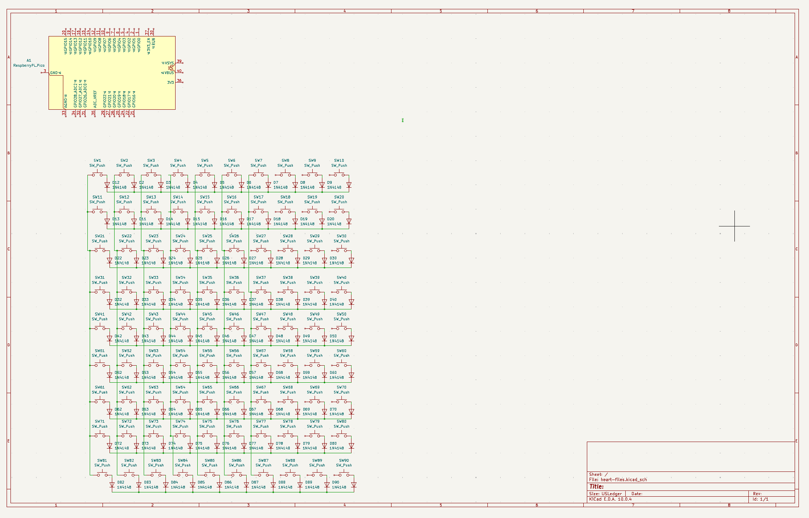

# keytomylove
a keyboard design for the **ysws** project [KEEB](https://keeb.hackclub.com)

this project is a project for teens following the **you ship we ship** model

In exchange for my hard work and learning on this project, the Hack Club non-profit is going to fund what it takes to bring it to life

## Process
### 1 -- pcb design is a delightful art I am learning... slowly
**+ 1.5 hrs**

It has taken a bit to figure out how to fit 90 keys with the amount of pins on the rpi pico, but wait there's more.

### 2 -- part selection
**not counting for time**

